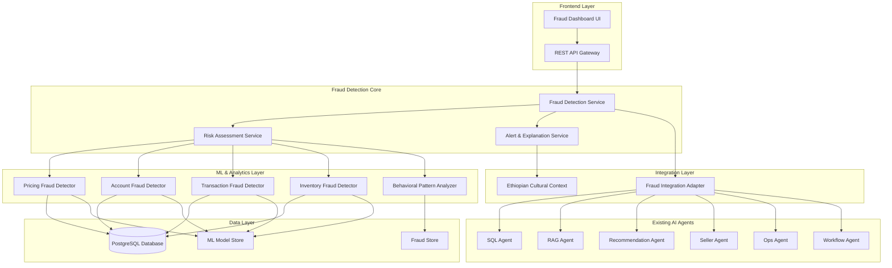
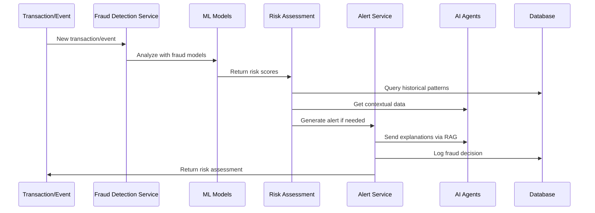
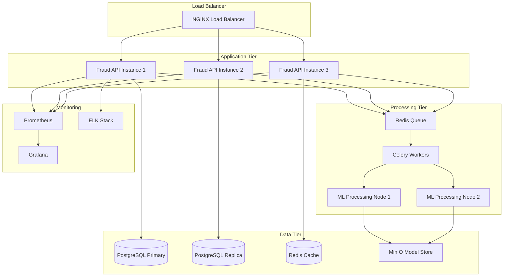

# Fraud Detection & Security AI - Design Document

## Overview

The Fraud Detection & Security AI system is designed as a comprehensive, culturally-aware fraud detection engine that integrates seamlessly with the existing Ethiopian Marketplace AI Engine. The system employs machine learning models, behavioral analysis, and real-time monitoring to detect, explain, and mitigate fraudulent activities while respecting Ethiopian market patterns and cultural trading practices.

The design follows a microservices architecture pattern, integrating with existing AI agents (SQL, RAG, Recommendation, Seller, Ops, Workflow) through well-defined APIs and shared data models. The system prioritizes explainability, cultural sensitivity, and actionable insights to protect all marketplace participants.

## Architecture

### System Architecture Overview



### Component Architecture

The system is organized into four main architectural layers:

1. **Detection Layer**: Core fraud detection algorithms and ML models
2. **Integration Layer**: Adapters for existing AI agents and cultural context
3. **Service Layer**: Business logic for risk assessment and alert generation
4. **API Layer**: RESTful endpoints for frontend and agent integration

### Data Flow Architecture



## Components and Interfaces

### Core Components

#### 1. Fraud Detection Service (FDS)
**Purpose**: Central orchestrator for all fraud detection activities
**Responsibilities**:
- Coordinate fraud detection across all models
- Manage real-time transaction monitoring
- Interface with existing AI agents
- Handle fraud detection workflows

**Key Methods**:
```python
class FraudDetectionService:
    def detect_fraud(self, event: FraudEvent) -> FraudResult
    def get_risk_score(self, entity_id: str, entity_type: str) -> RiskScore
    def process_real_time_event(self, transaction: Transaction) -> AlertDecision
    def get_fraud_history(self, entity_id: str) -> List[FraudIncident]
```

#### 2. Risk Assessment Service (RAS)
**Purpose**: Calculate and manage risk scores across all fraud types
**Responsibilities**:
- Aggregate risk scores from multiple detectors
- Apply Ethiopian cultural context adjustments
- Maintain dynamic risk thresholds
- Generate composite risk assessments

**Key Methods**:
```python
class RiskAssessmentService:
    def calculate_composite_risk(self, scores: List[RiskScore]) -> CompositeRisk
    def adjust_for_cultural_context(self, risk: RiskScore, context: EthiopianContext) -> RiskScore
    def update_risk_thresholds(self, performance_metrics: PerformanceMetrics) -> None
    def get_risk_explanation(self, risk: CompositeRisk) -> RiskExplanation
```

#### 3. Alert & Explanation Service (AES)
**Purpose**: Generate human-readable fraud alerts and explanations
**Responsibilities**:
- Create contextual fraud explanations
- Generate actionable recommendations
- Support multilingual alerts (Amharic/English)
- Integrate with notification systems

**Key Methods**:
```python
class AlertExplanationService:
    def generate_alert(self, fraud_result: FraudResult) -> FraudAlert
    def create_explanation(self, risk: CompositeRisk, language: str) -> Explanation
    def recommend_actions(self, fraud_type: FraudType, risk_level: RiskLevel) -> List[Action]
    def format_for_user_type(self, alert: FraudAlert, user_type: UserType) -> FormattedAlert
```

### ML Model Components

#### 1. Pricing Fraud Detector (PFD)
**Purpose**: Detect abnormal pricing patterns and manipulation
**Algorithm**: Ensemble of time series anomaly detection and clustering
**Features**:
- Price velocity analysis
- Seasonal adjustment factors
- Competitor pricing correlation
- Ethiopian holiday impact modeling

#### 2. Account Fraud Detector (AFD)
**Purpose**: Identify fake accounts and account takeover attempts
**Algorithm**: Graph neural networks for relationship analysis
**Features**:
- Login pattern analysis
- Device fingerprinting
- Social network analysis
- Behavioral biometrics

#### 3. Transaction Fraud Detector (TFD)
**Purpose**: Detect fraudulent transaction patterns
**Algorithm**: Isolation Forest with custom Ethiopian market features
**Features**:
- Transaction frequency analysis
- Amount pattern detection
- Timing correlation analysis
- Payment method risk scoring

#### 4. Inventory Fraud Detector (IFD)
**Purpose**: Identify inventory manipulation and phantom stock
**Algorithm**: Hidden Markov Models for state transition analysis
**Features**:
- Stock level consistency checking
- Availability pattern analysis
- Cross-seller inventory correlation
- Supply chain validation

### Integration Interfaces

#### 1. Fraud Integration Adapter (FIA)
**Purpose**: Seamless integration with existing AI agents
**Interfaces**:

```python
class FraudIntegrationAdapter:
    def enhance_sql_queries(self, query: str) -> str
    def provide_fraud_context_to_rag(self, context: str) -> str
    def integrate_with_recommendations(self, rec_request: RecommendationRequest) -> EnhancedRequest
    def alert_seller_agent(self, fraud_alert: FraudAlert) -> None
    def coordinate_with_ops(self, incident: FraudIncident) -> OpsResponse
    def route_through_workflow(self, fraud_event: FraudEvent) -> WorkflowDecision
```

#### 2. Ethiopian Cultural Context (ECC)
**Purpose**: Apply cultural awareness to fraud detection
**Capabilities**:
- Holiday and seasonal pattern recognition
- Regional pricing variation understanding
- Traditional trading practice validation
- Cultural behavior modeling

## Data Models

### Core Data Models

#### FraudEvent
```python
@dataclass
class FraudEvent:
    event_id: str
    event_type: FraudEventType  # TRANSACTION, PRICING, ACCOUNT, INVENTORY
    entity_id: str  # user_id, product_id, transaction_id
    timestamp: datetime
    data: Dict[str, Any]  # Event-specific data
    source: str  # Which system generated the event
    metadata: Dict[str, Any]  # Additional context
```

#### RiskScore
```python
@dataclass
class RiskScore:
    score: float  # 0-100 risk score
    confidence: float  # 0-1 confidence in the score
    fraud_type: FraudType
    contributing_factors: List[RiskFactor]
    cultural_adjustments: List[CulturalAdjustment]
    timestamp: datetime
```

#### FraudResult
```python
@dataclass
class FraudResult:
    event_id: str
    overall_risk: RiskScore
    individual_risks: List[RiskScore]
    decision: FraudDecision  # ALLOW, MONITOR, FLAG, BLOCK
    explanation: str
    recommended_actions: List[Action]
    requires_human_review: bool
```

#### FraudAlert
```python
@dataclass
class FraudAlert:
    alert_id: str
    severity: AlertSeverity  # LOW, MEDIUM, HIGH, CRITICAL
    fraud_type: FraudType
    affected_entities: List[str]
    risk_score: float
    explanation: str
    evidence: List[Evidence]
    recommended_actions: List[Action]
    created_at: datetime
    language: str  # 'en' or 'am'
```

### Ethiopian Context Models

#### EthiopianContext
```python
@dataclass
class EthiopianContext:
    current_season: Season  # MEHER, BELG, DRY
    active_holidays: List[Holiday]
    regional_factors: Dict[str, RegionalFactor]
    market_conditions: MarketCondition
    cultural_events: List[CulturalEvent]
```

#### CulturalAdjustment
```python
@dataclass
class CulturalAdjustment:
    adjustment_type: str
    factor: float  # Multiplier for risk score
    reason: str
    confidence: float
    applicable_period: DateRange
```

### Database Schema Extensions

#### fraud_events Table
```sql
CREATE TABLE fraud_events (
    id UUID PRIMARY KEY DEFAULT gen_random_uuid(),
    event_type VARCHAR(50) NOT NULL,
    entity_id VARCHAR(100) NOT NULL,
    entity_type VARCHAR(50) NOT NULL,
    risk_score DECIMAL(5,2),
    confidence DECIMAL(3,2),
    decision VARCHAR(20),
    explanation TEXT,
    evidence JSONB,
    created_at TIMESTAMP DEFAULT CURRENT_TIMESTAMP,
    processed_at TIMESTAMP,
    status VARCHAR(20) DEFAULT 'PENDING'
);
```

#### fraud_patterns Table
```sql
CREATE TABLE fraud_patterns (
    id UUID PRIMARY KEY DEFAULT gen_random_uuid(),
    pattern_type VARCHAR(50) NOT NULL,
    pattern_data JSONB NOT NULL,
    detection_count INTEGER DEFAULT 0,
    last_detected TIMESTAMP,
    effectiveness_score DECIMAL(3,2),
    cultural_context JSONB,
    created_at TIMESTAMP DEFAULT CURRENT_TIMESTAMP
);
```

#### risk_profiles Table
```sql
CREATE TABLE risk_profiles (
    entity_id VARCHAR(100) PRIMARY KEY,
    entity_type VARCHAR(50) NOT NULL,
    current_risk_score DECIMAL(5,2),
    risk_history JSONB,
    behavioral_profile JSONB,
    cultural_factors JSONB,
    last_updated TIMESTAMP DEFAULT CURRENT_TIMESTAMP
);
```

## Error Handling

### Error Classification

#### 1. Detection Errors
- **Model Prediction Failures**: Fallback to rule-based detection
- **Data Quality Issues**: Implement data validation and cleansing
- **Performance Degradation**: Circuit breaker pattern with graceful degradation

#### 2. Integration Errors
- **Agent Communication Failures**: Retry with exponential backoff
- **Database Connection Issues**: Connection pooling with failover
- **External Service Timeouts**: Asynchronous processing with queuing

#### 3. Cultural Context Errors
- **Missing Cultural Data**: Default to conservative risk assessment
- **Seasonal Pattern Failures**: Fallback to historical averages
- **Regional Data Gaps**: Use national-level patterns as backup

### Error Recovery Strategies

```python
class FraudErrorHandler:
    def handle_model_failure(self, model_type: str, fallback_strategy: str) -> FraudResult
    def handle_integration_error(self, agent: str, retry_count: int) -> IntegrationResult
    def handle_cultural_context_error(self, context_type: str) -> CulturalContext
    def escalate_to_human_review(self, error: FraudError) -> EscalationResult
```

### Monitoring and Alerting

- **Model Performance Monitoring**: Track accuracy, precision, recall
- **System Health Monitoring**: Monitor response times, error rates
- **Cultural Context Validation**: Verify seasonal adjustments are working
- **Integration Health Checks**: Monitor agent communication status

## Testing Strategy

### Dual Testing Approach

The fraud detection system requires both unit testing for specific scenarios and property-based testing for comprehensive coverage across the vast input space of potential fraud patterns.

#### Unit Testing Focus
- **Specific fraud scenarios**: Test known fraud patterns with concrete examples
- **Ethiopian cultural edge cases**: Validate holiday pricing adjustments, seasonal patterns
- **Integration points**: Test agent communication and data flow
- **Error conditions**: Verify graceful handling of failures and edge cases
- **Alert generation**: Test multilingual alerts and explanation quality

#### Property-Based Testing Focus
- **Universal fraud detection properties**: Verify detection consistency across all inputs
- **Risk score properties**: Ensure risk calculations follow mathematical constraints
- **Cultural adjustment properties**: Validate cultural factors are applied consistently
- **Integration properties**: Verify agent interactions maintain data integrity

### Testing Configuration

**Property-Based Testing Setup**:
- Use Hypothesis (Python) for property-based test generation
- Minimum 100 iterations per property test for statistical confidence
- Custom generators for Ethiopian marketplace data (products, users, transactions)
- Fraud pattern generators that create realistic attack scenarios

**Test Data Strategy**:
- **Synthetic Ethiopian marketplace data**: Generate realistic teff, coffee, honey transactions
- **Cultural calendar integration**: Test data includes Ethiopian holidays and seasons
- **Multi-language test cases**: Validate Amharic and English alert generation
- **Regional variation data**: Test with different Ethiopian regional patterns

**Performance Testing**:
- **Load testing**: 10,000+ transactions per hour processing
- **Latency testing**: <2 second fraud detection response time
- **Accuracy testing**: Maintain >95% true positive rate, <5% false positive rate
- **Cultural accuracy testing**: Validate Ethiopian context adjustments

## Correctness Properties

*A property is a characteristic or behavior that should hold true across all valid executions of a system—essentially, a formal statement about what the system should do. Properties serve as the bridge between human-readable specifications and machine-verifiable correctness guarantees.*

The fraud detection system must satisfy several critical correctness properties to ensure reliable, accurate, and performant fraud detection across all Ethiopian marketplace scenarios.

### Detection Accuracy Properties

**Property 1: Pricing Manipulation Detection Accuracy**
*For any* simulated pricing manipulation attack scenario, the pricing fraud detection system should correctly identify it as fraudulent with 95% or higher accuracy
**Validates: Requirements 5.1.1**

**Property 2: False Positive Rate Constraint**
*For any* legitimate Ethiopian marketplace transaction pattern, the fraud detection system should maintain a false positive rate below 5% over any 30-day testing period
**Validates: Requirements 5.1.2**

**Property 3: Risk Score Correlation**
*For any* fraud scenario with both automated risk scores and manual expert assessments, the correlation between automated and manual scores should be 90% or higher
**Validates: Requirements 5.1.4**

### Performance and Responsiveness Properties

**Property 4: Coordinated Fraud Detection Timeliness**
*For any* coordinated fraud pattern occurring across multiple entities, the system should detect and alert within 15 minutes of pattern emergence
**Validates: Requirements 5.1.3**

**Property 5: System Response Time Performance**
*For any* fraud detection request (SQL queries, RAG explanations, transaction processing), the system should respond within the specified time limits: SQL queries <1s, RAG explanations <3s, transaction processing adds <200ms latency
**Validates: Requirements 5.2.2, 5.2.3, 5.4.2**

**Property 6: Concurrent Processing Capability**
*For any* load of 1000 concurrent transactions, the fraud detection system should process all transactions without introducing processing delays beyond normal latency bounds
**Validates: Requirements 5.4.1**

### Integration and Functionality Properties

**Property 7: Agent Integration Performance**
*For any* existing AI agent operation, enabling fraud detection integration should not degrade the agent's response time or functionality beyond acceptable performance thresholds
**Validates: Requirements 5.2.1**

**Property 8: Risk-Aware Recommendations**
*For any* product recommendation request, when fraud risk data is available, the recommendation engine should incorporate fraud risk factors into the recommendation scoring and ranking
**Validates: Requirements 5.2.4**

**Property 9: Alert Completeness**
*For any* generated fraud alert, the alert should contain a non-empty list of actionable recommendations appropriate to the fraud type and risk level
**Validates: Requirements 5.3.2**

**Property 10: Dashboard Data Accessibility**
*For any* fraud trend analysis request through the dashboard interface, the system should return properly formatted fraud trend data including historical patterns and current risk metrics
**Validates: Requirements 5.3.3**

### System Reliability Properties

**Property 11: Accuracy Under Load**
*For any* peak load condition simulating Ethiopian market hours, the fraud detection system should maintain accuracy metrics (>95% true positive rate, <5% false positive rate) within acceptable bounds
**Validates: Requirements 5.4.3**

**Property 12: Hot Model Updates**
*For any* machine learning model update operation, the system should continue processing fraud detection requests without service interruption or significant performance degradation during the update process
**Validates: Requirements 5.4.4**

### Cultural Context Properties

**Property 13: Ethiopian Cultural Pattern Recognition**
*For any* legitimate Ethiopian cultural trading pattern (holiday pricing, seasonal variations, regional differences), the fraud detection system should correctly classify it as non-fraudulent and apply appropriate cultural context adjustments
**Validates: Requirements 6.1, 6.2**

**Property 14: Multilingual Alert Generation**
*For any* fraud alert generation request specifying Amharic or English language, the system should generate culturally appropriate and linguistically correct alerts in the requested language
**Validates: Requirements NFR-4.1, NFR-4.2**

### Data Integrity Properties

**Property 15: Fraud Event Logging**
*For any* fraud detection decision (allow, monitor, flag, block), the system should create a complete audit log entry with decision rationale, evidence, and timestamp for compliance and analysis purposes
**Validates: Requirements NFR-3.3, FR-10.4**

**Property 16: Risk Profile Consistency**
*For any* entity (user, product, transaction) with multiple risk assessments over time, the risk profile should maintain consistency in scoring methodology while appropriately reflecting behavioral changes
**Validates: Requirements FR-6.1, FR-6.3**
## Implementation Approach

### Development Phases

#### Phase 1: Core Infrastructure (Weeks 1-2)
- Set up fraud detection database schema
- Implement basic fraud event processing pipeline
- Create integration adapters for existing AI agents
- Establish Ethiopian cultural context framework

#### Phase 2: ML Model Development (Weeks 3-5)
- Develop and train pricing fraud detection models
- Implement account fraud detection algorithms
- Create transaction pattern analysis models
- Build inventory fraud detection capabilities

#### Phase 3: Risk Assessment & Alerts (Weeks 6-7)
- Implement risk scoring and aggregation system
- Create alert generation and explanation services
- Develop multilingual support for Amharic and English
- Integrate with existing notification systems

#### Phase 4: Integration & Testing (Weeks 8-9)
- Complete integration with all existing AI agents
- Implement comprehensive testing suite
- Conduct Ethiopian market pattern validation
- Performance optimization and tuning

#### Phase 5: Deployment & Monitoring (Week 10)
- Production deployment with monitoring
- Establish fraud detection dashboards
- Implement continuous model improvement
- Documentation and training materials

### Technology Stack

**Backend Services**:
- Python 3.9+ with FastAPI for REST APIs
- PostgreSQL for primary data storage
- Redis for caching and real-time data
- Celery for background task processing

**Machine Learning**:
- scikit-learn for traditional ML algorithms
- TensorFlow/PyTorch for deep learning models
- MLflow for model versioning and deployment
- Apache Airflow for ML pipeline orchestration

**Integration**:
- Existing AI agent APIs and interfaces
- SQLAlchemy for database ORM
- Pydantic for data validation
- LangChain for LLM integration

**Monitoring & Observability**:
- Prometheus for metrics collection
- Grafana for visualization
- ELK stack for log aggregation
- Custom fraud detection dashboards

### Deployment Architecture



### Security Considerations

**Data Protection**:
- End-to-end encryption for all fraud data
- Role-based access control for fraud information
- Data anonymization for ML model training
- Secure model storage and versioning

**API Security**:
- OAuth 2.0 authentication for all endpoints
- Rate limiting to prevent abuse
- Input validation and sanitization
- Audit logging for all fraud decisions

**Model Security**:
- Model versioning and rollback capabilities
- Adversarial attack detection
- Model drift monitoring
- Secure model deployment pipelines

### Scalability Design

**Horizontal Scaling**:
- Stateless fraud detection services
- Load-balanced API endpoints
- Distributed ML model inference
- Sharded fraud data storage

**Performance Optimization**:
- Caching of frequently accessed fraud patterns
- Asynchronous processing for non-critical operations
- Database query optimization
- Model inference optimization

**Resource Management**:
- Auto-scaling based on fraud detection load
- Resource quotas for ML model training
- Memory-efficient data structures
- Optimized database connections

## Conclusion

This design provides a comprehensive, culturally-aware fraud detection system that integrates seamlessly with the existing Ethiopian Marketplace AI Engine. The system balances accuracy, performance, and explainability while respecting Ethiopian market patterns and cultural trading practices.

Key design strengths:
- **Cultural Sensitivity**: Deep integration of Ethiopian market context
- **Explainable AI**: Clear, actionable fraud explanations
- **Seamless Integration**: Works with all existing AI agents
- **Scalable Architecture**: Handles marketplace growth
- **Comprehensive Coverage**: Detects all major fraud types
- **Real-time Processing**: Immediate fraud detection and alerting

The property-based testing approach ensures the system maintains correctness across the vast space of possible fraud scenarios, while unit tests validate specific Ethiopian market edge cases and integration points.

This design positions the Ethiopian Marketplace AI Engine as a leader in culturally-aware, explainable fraud detection for emerging markets.